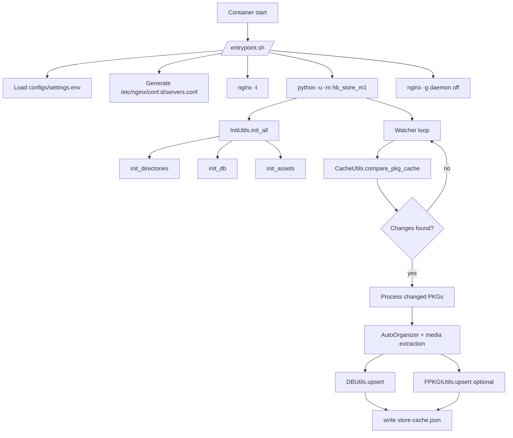
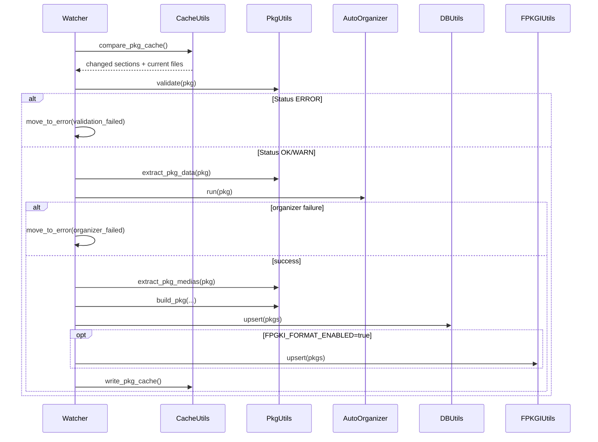

# hb-store-m1

[](https://github.com/fabiocdo/hb-store-m1)
[](https://hub.docker.com/repository/docker/fabiocdo/hb-store-m1)
[](https://hub.docker.com/repository/docker/fabiocdo/hb-store-m1)

Local CDN for PS4 Homebrew PKGs, with automatic organization, media extraction, SQLite indexing (`store.db`), and optional fPKGi JSON output.


## Project Links

- GitLab: https://gitlab.com/fabiocdo/hb-store-m1
- GitHub: https://github.com/fabiocdo/hb-store-m1
- Docker Hub: https://hub.docker.com/repository/docker/fabiocdo/hb-store-m1

## Open Source and Community Intent

This project is open source, built as a community utility, and maintained as a hobby/non-profit effort.

- Anyone can use, modify, and distribute it.
- Commercial intent is not the project's goal.
- Credits are kindly requested when redistributing forks/derivatives.
- Feedback is welcome via issues/PRs on GitLab or GitHub.
- GitLab issues: https://gitlab.com/fabiocdo/hb-store-m1/-/issues
- GitHub issues: https://github.com/fabiocdo/hb-store-m1/issues

## Overview

The service runs in a single container with two processes:

- `nginx` serving files from `/app/data`
- `python -u -m hb_store_m1` running the watcher in the background

Main pipeline:

1. Initialize directories, database, and base assets.
2. Detect PKG/PNG changes via cache (`store-cache.json`).
3. Validate PKG, extract `PARAM.SFO` and media (`ICON0/PIC0/PIC1`).
4. Move/rename to canonical destination using `content_id`.
5. Update `store.db` and optional `*.json` files by app type.

## Runtime Architecture



## Current Features

- Serve PKGs with `Accept-Ranges` and long cache headers.
- Organize PKGs by type into:
  - `game`, `dlc`, `update`, `save`, `unknown`
- Rename PKGs to `<CONTENT_ID>.pkg`.
- Extract:
  - `ICON0_PNG` (required)
  - `PIC0_PNG` and `PIC1_PNG` (optional)
- Update `store.db` using `upsert` by `content_id`.
- Generate app-type JSON files when `FPGKI_FORMAT_ENABLED=true`.
- Keep incremental cache in `data/_cache/store-cache.json`.
- Move invalid/conflicting files to `data/_errors`.
- Persist `WARN/ERROR` logs to `data/_logs/app_errors.log`.

## Repository Structure

```text
.
|-- Dockerfile
|-- docker-compose.yml
|-- docker/
|   |-- entrypoint.sh
|   |-- nginx/
|   |   |-- nginx.template.conf
|   |   `-- common.locations.conf
|-- src/hb_store_m1/
|   |-- main.py
|   |-- modules/
|   |   |-- watcher.py
|   |   `-- auto_organizer.py
|   |-- utils/
|   |   |-- init_utils.py
|   |   |-- cache_utils.py
|   |   |-- pkg_utils.py
|   |   |-- db_utils.py
|   |   |-- fpkgi_utils.py
|   |   |-- file_utils.py
|   |   `-- log_utils.py
|   |-- helpers/
|   |   |-- pkgtool.py
|   |   `-- store_assets_client.py
|   `-- models/
|       |-- globals.py
|       `-- ...
|-- init/
|   `-- store_db.sql
`-- tests/
```

## Run with Docker Compose

### 1) Start

```bash
docker compose up --build -d
```

### 2) Follow logs

```bash
docker compose logs -f hb-store-m1
```

### 3) Stop

```bash
docker compose down
```

## Configuration (`configs/settings.env`)

`entrypoint.sh` creates this file automatically on first run.

| Variable | Type | Default in entrypoint | Description |
|---|---|---|---|
| `SERVER_IP` | string | `127.0.0.1` | Host used to build URLs (`SERVER_URL`). |
| `SERVER_PORT` | int | `80` | Nginx port inside container. |
| `ENABLE_TLS` | bool | `false` | `true` requires `configs/certs/tls.crt` and `tls.key`. |
| `LOG_LEVEL` | string | `info` | `debug`, `info`, `warn`, `error`. |
| `WATCHER_ENABLED` | bool | `true` | Enable/disable watcher loop. |
| `WATCHER_PERIODIC_SCAN_SECONDS` | int | `30` | Scan loop interval. |
| `FPGKI_FORMAT_ENABLED` | bool | `false` | Generate/update per-type JSON output (`game.json`, etc.). |
| `PKGTOOL_TIMEOUT_SECONDS` | int | `300` | Generic timeout for lightweight `pkgtool` commands. |
| `PKGTOOL_VALIDATE_TIMEOUT_SECONDS` | int | `300` | Base timeout for `pkg_validate`. |
| `PKGTOOL_VALIDATE_TIMEOUT_PER_GB_SECONDS` | int | `45` | Extra timeout budget per GiB for `pkg_validate`. |
| `PKGTOOL_VALIDATE_TIMEOUT_MAX_SECONDS` | int | `3600` | Upper cap for `pkg_validate` timeout (`0` disables cap). |

Notes:

- The environment variable name is `FPGKI_FORMAT_ENABLED` (kept as-is in code).
- Python runs with `-u` (unbuffered) in the entrypoint.
- If `ENABLE_TLS=true` and certs are missing, container startup fails.
- Validation timeout is adaptive for large files:
  - `max(PKGTOOL_VALIDATE_TIMEOUT_SECONDS, ceil(size_gib) * PKGTOOL_VALIDATE_TIMEOUT_PER_GB_SECONDS)`,
  - capped by `PKGTOOL_VALIDATE_TIMEOUT_MAX_SECONDS` when this value is greater than `0`.

## Volumes

Current `docker-compose.yml`:

```yaml
services:
  hb-store-m1:
    build: .
    image: fabiocdo/hb-store-m1:latest
    container_name: hb-store-m1
    ports:
      - "80:80"
      - "443:443"
    volumes:
      - ./data:/app/data
      - ./configs:/app/configs
    restart: unless-stopped
```

Port mapping note:

- If `SERVER_PORT` in `configs/settings.env` is different from `80` or `443`, you must publish that same port in `docker-compose.yml`.
- Example: for `SERVER_PORT=8443`, add `- "8443:8443"` under `ports`.

## Data Layout (`/app/data`)

```text
/app/data
|-- _cache/
|   |-- store-cache.json
|   |-- homebrew.elf
|   |-- homebrew.elf.sig
|   `-- remote.md5
|-- _errors/
|   `-- *.pkg
|-- _logs/
|   `-- app_errors.log
|-- pkg/
|   |-- app/
|   |-- dlc/
|   |-- game/
|   |-- save/
|   |-- update/
|   |-- unknown/
|   `-- _media/
|-- store.db
|-- dlc.json
|-- game.json
|-- save.json
|-- update.json
`-- unknown.json
```

Important notes:

- `store-cache.json` stores metadata (`size|mtime_ns|filename`), not PKG content.
- Cache generation is lightweight and does not call `pkgtool`; for new/changed files it uses filename stem as key.
- After successful processing/normalization, keys converge to canonical `content_id` values.
- `data/_errors` receives PKGs that fail validation/conflict/processing rules.

## PKG Processing Flow



## Type/Region Mapping

From the `PKG` model:

- Category -> app type:
  - `AC` -> `dlc`
  - `GC`/`GD` -> `game`
  - `GP` -> `update`
  - `SD` -> `save`
  - others -> `unknown`
- `content_id` prefix -> region:
  - `UP` USA, `EP` EUR, `JP` JAP, `HP/AP/KP` ASIA, others `UNKNOWN`

## Exposed HTTP Endpoints (nginx)

| Endpoint | Source | Behavior |
|---|---|---|
| `/` | `/_cache/index.html` | status/info HTML page with endpoint links and live UP/DOWN checks |
| `/health` | inline response | returns `{"status":"online"}` |
| `/store.db` | `/app/data/store.db` | `no-store`, byte-range enabled |
| `/api.php?db_check_hash=true` | internal API | returns `{"hash":"<md5_of_store.db>"}` |
| `/api.php` | `/app/data/_cache/store.db.json` | serves JSON if file exists |
| `/download.php?tid=<TITLE_ID>&check=true` | internal API + SQLite | returns `{"number_of_downloads":N}` |
| `/download.php?tid=<TITLE_ID>` | internal API + SQLite | serves matching PKG file (supports range via nginx internal path) |
| `/update/remote.md5` | `/_cache/remote.md5` | `no-store` |
| `/update/homebrew.elf` | `/_cache/homebrew.elf` | `no-store` |
| `/update/homebrew.elf.sig` | `/_cache/homebrew.elf.sig` | `no-store` |
| `/pkg/**/*.pkg` | `/app/data/pkg` | long cache (`max-age=31536000`, `immutable`), range |
| `/pkg/**/*.(png|jpg|jpeg|webp)` | `/app/data/pkg` | 30-day cache |
| `/pkg/**/*.(json|db)` | `/app/data/pkg` | `no-store` |

## Credits and References

Project/client references:

- PS4-Store client base reference: https://github.com/LightningMods/PS4-Store
- fPKGi ecosystem/reference format: https://github.com/hippie68/fPKGi

Core tooling/runtime references:

- OpenOrbis toolchain (used in Dockerfile for `pkgtool`): https://github.com/OpenOrbis/OpenOrbis-PS4-Toolchain
- OpenOrbis toolchain Docker image: https://hub.docker.com/r/openorbisofficial/toolchain
- Python official image (`python:3.12-slim`): https://hub.docker.com/_/python
- Nginx: https://nginx.org
- SQLite: https://www.sqlite.org

Python dependencies (`pyproject.toml`):

- PyGithub: https://github.com/PyGithub/PyGithub
- pydantic: https://github.com/pydantic/pydantic
- tabulate: https://github.com/astanin/python-tabulate
- pytest: https://github.com/pytest-dev/pytest
- pytest-cov: https://github.com/pytest-dev/pytest-cov

## Local Development (without Docker)

Requirements:

- Python 3.12+
- working `bin/pkgtool`
- native runtime libraries required by `pkgtool`

Run:

```bash
python -m venv .venv
. .venv/bin/activate
pip install -U pip
pip install -e .
python -m hb_store_m1
```

Tests:

```bash
.venv/bin/pytest -q
.venv/bin/pytest --cov=hb_store_m1 --cov-report=term-missing --cov-fail-under=90
```

## Troubleshooting

### `docker compose up` does not start the service

- Check:
  - `docker compose logs hb-store-m1`
  - `nginx -t` output (already executed by entrypoint)
- Common cause: `ENABLE_TLS=true` without `configs/certs/tls.crt` and `tls.key`.

### Valid PKG moved to `_errors`

- Check `data/_logs/app_errors.log`.
- Common reasons:
  - critical validation failure
  - `PARAM.SFO` extraction failure
  - missing `ICON0_PNG`
  - destination conflict (`content_id.pkg` already exists)

### `No usable version of libssl was found`

- This means a native dependency required by `pkgtool` is missing.
- Current Dockerfile already copies `libssl.so.1.1` and `libcrypto.so.1.1` from toolchain.

### Large PKGs (`>20GB`) timing out in `pkg_validate`

- Increase timeout knobs in `configs/settings.env`, for example:

```env
PKGTOOL_VALIDATE_TIMEOUT_SECONDS=300
PKGTOOL_VALIDATE_TIMEOUT_PER_GB_SECONDS=90
PKGTOOL_VALIDATE_TIMEOUT_MAX_SECONDS=7200
```

- For very large files, increase `PKGTOOL_VALIDATE_TIMEOUT_PER_GB_SECONDS` first.
- If `settings.env` already existed, add these variables manually (the entrypoint does not overwrite existing files).

### App version in banner did not update

Rebuild and restart:

```bash
docker compose up --build -d
```

The app reads version from `pyproject.toml` when available, with fallback to installed package metadata.

## License

This project is licensed under MIT. See `LICENSE`.

Gentle request (non-binding): if you publish a fork or derivative, please keep credits to the original project and upstream references.
