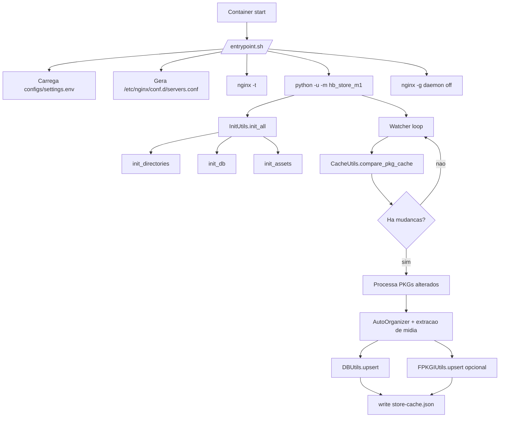
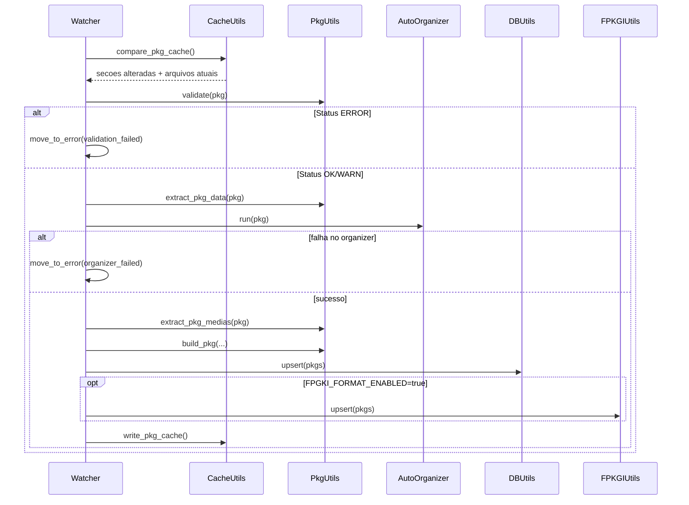

# hb-store-m1

Local CDN para PKGs de PS4 Homebrew, com organizacao automatica, extracao de midia, indexacao em SQLite (`store.db`) e saida JSON opcional para fPKGi.


## Visao geral

O servico sobe em um unico container com dois processos:

- `nginx` servindo arquivos em `/app/data`
- `python -u -m hb_store_m1` rodando o watcher em background

Pipeline principal:

1. Inicializa diretorios, banco e assets base.
2. Detecta mudancas de arquivos PKG/PNG via cache (`store-cache.json`).
3. Valida PKG, extrai `PARAM.SFO` e midias (`ICON0/PIC0/PIC1`).
4. Move/renomeia para o destino final por `content_id`.
5. Atualiza `store.db` e (opcional) arquivos `*.json` por tipo.

## Arquitetura (execucao)



## Funcionalidades atuais

- Servir PKGs com `Accept-Ranges` e cache longo.
- Organizar PKGs por tipo em:
  - `game`, `dlc`, `update`, `save`, `unknown`
- Renomear para `<CONTENT_ID>.pkg`.
- Extrair:
  - `ICON0_PNG` (obrigatorio)
  - `PIC0_PNG` e `PIC1_PNG` (opcionais)
- Atualizar `store.db` com `upsert` por `content_id`.
- Gerar JSON por tipo quando `FPGKI_FORMAT_ENABLED=true`.
- Manter cache incremental em `data/_cache/store-cache.json`.
- Mover arquivos invalidos/conflitantes para `data/_errors`.
- Persistir logs de `WARN/ERROR` em `data/_logs/app_errors.log`.

## Estrutura do repositorio

```text
.
|-- Dockerfile
|-- docker-compose.yml
|-- docker/
|   |-- entrypoint.sh
|   |-- nginx/
|   |   |-- nginx.template.conf
|   |   `-- common.locations.conf
|-- src/hb_store_m1/
|   |-- main.py
|   |-- modules/
|   |   |-- watcher.py
|   |   `-- auto_organizer.py
|   |-- utils/
|   |   |-- init_utils.py
|   |   |-- cache_utils.py
|   |   |-- pkg_utils.py
|   |   |-- db_utils.py
|   |   |-- fpkgi_utils.py
|   |   |-- file_utils.py
|   |   `-- log_utils.py
|   |-- helpers/
|   |   |-- pkgtool.py
|   |   `-- store_assets_client.py
|   `-- models/
|       |-- globals.py
|       `-- ...
|-- init/
|   `-- store_db.sql
`-- tests/
```

## Como rodar (Docker Compose)

### 1) Subir

```bash
docker compose up --build -d
```

### 2) Ver logs

```bash
docker compose logs -f hb-store-m1
```

### 3) Parar

```bash
docker compose down
```

## Configuracao (`configs/settings.env`)

O `entrypoint` cria esse arquivo automaticamente na primeira execucao.

| Variavel | Tipo | Default no entrypoint | Descricao |
|---|---|---|---|
| `SERVER_IP` | string | `127.0.0.1` | Host usado para compor URLs (`SERVER_URL`). |
| `SERVER_PORT` | int | `80` | Porta do nginx no container. |
| `ENABLE_TLS` | bool | `false` | `true` exige `configs/certs/tls.crt` e `tls.key`. |
| `LOG_LEVEL` | string | `info` | `debug`, `info`, `warn`, `error`. |
| `WATCHER_ENABLED` | bool | `true` | Liga/desliga watcher. |
| `WATCHER_PERIODIC_SCAN_SECONDS` | int | `30` | Intervalo do loop de varredura. |
| `FPGKI_FORMAT_ENABLED` | bool | `false` | Gera/atualiza JSON por tipo (`game.json`, etc.). |

Observacoes:

- O nome da variavel e `FPGKI_FORMAT_ENABLED` (mantido como esta no codigo).
- `python` roda com `-u` (`unbuffered`) no entrypoint.
- Quando `ENABLE_TLS=true`, sem certificado o container aborta com erro fatal.

## Volumes

`docker-compose.yml` atual:

```yaml
services:
  hb-store-m1:
    build: .
    image: fabiocdo/hb-store-m1:latest
    container_name: hb-store-m1
    ports:
      - "80:80"
      - "443:443"
    volumes:
      - ./data:/app/data
      - ./configs:/app/configs
    restart: unless-stopped
```

## Layout de dados (`/app/data`)

```text
/app/data
|-- _cache/
|   |-- store-cache.json
|   |-- homebrew.elf
|   |-- homebrew.elf.sig
|   `-- remote.md5
|-- _errors/
|   `-- *.pkg
|-- _logs/
|   `-- app_errors.log
|-- pkg/
|   |-- app/
|   |-- dlc/
|   |-- game/
|   |-- save/
|   |-- update/
|   |-- unknown/
|   `-- _media/
|-- store.db
|-- dlc.json
|-- game.json
|-- save.json
|-- update.json
`-- unknown.json
```

Observacoes importantes:

- `store-cache.json` guarda metadados (`size|mtime_ns|filename`), nao o arquivo PKG em si.
- Chave do cache tende a ser `content_id`; quando falha leitura, usa fallback pelo nome do arquivo.
- `data/_errors` recebe PKGs com falha de validacao/conflito/processamento.

## Fluxo de processamento de PKG



## Mapeamento de tipo/regiao

Pelo modelo `PKG`:

- Categoria -> tipo:
  - `AC` -> `dlc`
  - `GC`/`GD` -> `game`
  - `GP` -> `update`
  - `SD` -> `save`
  - outro -> `unknown`
- Prefixo do `content_id` -> regiao:
  - `UP` USA, `EP` EUR, `JP` JAP, `HP/AP/KP` ASIA, resto `UNKNOWN`

## Endpoints HTTP expostos (nginx)

| Endpoint | Origem | Comportamento |
|---|---|---|
| `/` | redirect | `302` para `/store.db` |
| `/store.db` | `/app/data/store.db` | `no-store`, range habilitado |
| `/api.php` | `/app/data/_cache/store.db.json` | retorna JSON se o arquivo existir |
| `/update/remote.md5` | `/_cache/remote.md5` | `no-store` |
| `/update/homebrew.elf` | `/_cache/homebrew.elf` | `no-store` |
| `/update/homebrew.elf.sig` | `/_cache/homebrew.elf.sig` | `no-store` |
| `/update/store.prx` | `/_cache/store.prx` | `no-store` |
| `/update/store.prx.sig` | `/_cache/store.prx.sig` | `no-store` |
| `/pkg/**/*.pkg` | `/app/data/pkg` | cache longo (`max-age=31536000`, `immutable`), range |
| `/pkg/**/*.(png|jpg|jpeg|webp)` | `/app/data/pkg` | cache de 30 dias |
| `/pkg/**/*.(json|db)` | `/app/data/pkg` | `no-store` |

## CI/CD (GitLab)

Pipeline atual (`.gitlab-ci.yml`):

1. `test`
   - roda `pytest` com cobertura
   - gate: `--cov-fail-under=90`
   - publica `coverage.xml` (cobertura no GitLab)

2. `mirror_to_github`
   - roda em `push` para `main`
   - executa `git push --mirror` para GitHub
   - requer variaveis:
     - `GITHUB_MIRROR_REPO` (`owner/repo`)
     - `GITHUB_MIRROR_USER`
     - `GITHUB_MIRROR_TOKEN`

3. `build`
   - build da imagem docker por commit (`$CI_COMMIT_SHA`)
   - exporta artifact `image.tar`

4. `publish:*` (manual)
   - `publish:release`, `publish:stable`, `publish:dev`
   - tag baseada no `version` do `pyproject.toml`
   - requer:
     - `DOCKER_HUB_USER`
     - `DOCKER_HUB_TOKEN`

## Desenvolvimento local (sem Docker)

Requisitos:

- Python 3.12+
- `bin/pkgtool` funcional
- bibliotecas nativas compativeis com o `pkgtool`

Execucao:

```bash
python -m venv .venv
. .venv/bin/activate
pip install -U pip
pip install -e .
python -m hb_store_m1
```

Testes:

```bash
.venv/bin/pytest -q
.venv/bin/pytest --cov=hb_store_m1 --cov-report=term-missing --cov-fail-under=90
```

## Troubleshooting

### `docker compose up` nao sobe servico

- Verifique:
  - `docker compose logs hb-store-m1`
  - `nginx -t` (ja roda no entrypoint)
- Causa comum: `ENABLE_TLS=true` sem `configs/certs/tls.crt` e `tls.key`.

### PKG bom foi para `_errors`

- Veja `data/_logs/app_errors.log`.
- Motivos comuns:
  - validacao critica falhou
  - erro ao extrair `PARAM.SFO`
  - `ICON0_PNG` ausente
  - conflito de destino (`content_id.pkg` ja existe)

### `No usable version of libssl was found`

- Isso indica dependencia nativa faltando para `pkgtool` em runtime.
- O Dockerfile do projeto ja copia `libssl.so.1.1` e `libcrypto.so.1.1` da toolchain.

### Versao do app nao atualizou no banner

- Rode com rebuild:

```bash
docker compose up --build -d
```

- O banner le versao do `pyproject.toml` quando disponivel, com fallback para metadata do pacote instalado.

## Licenca

Defina aqui a licenca oficial do projeto (ex.: MIT, GPL-3.0).
